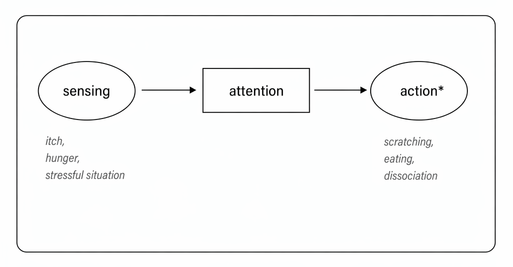
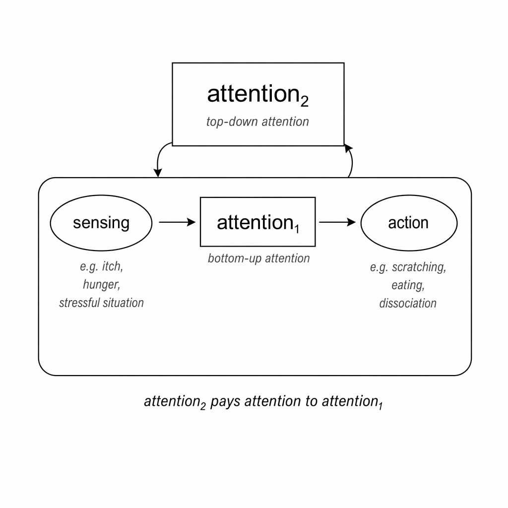
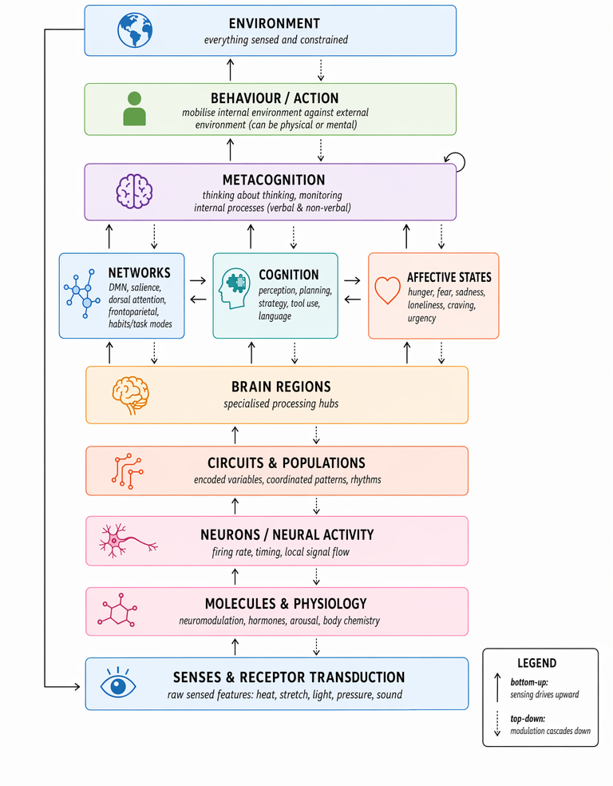
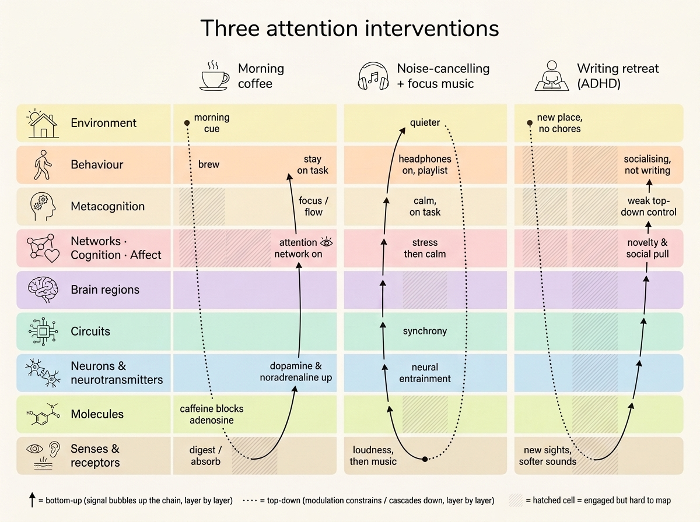

> Attention is our most valuable resource. When engaged, we can learn, create memories and connect with others. Attention carries a transformative power, yet in a society shaped to exploit it, we often give it up for nothing. In this piece I take a journey into defining attention, starting from language, venturing into technology and the economy and concluding with a map to help us locate attention among our brains, our bodies and the environment around us.

Ever since being diagnosed with Attention Deficit Disorder (ADD — ADHD non-hyperactive cousin) in early 2025 and seeking a diagnosis 9 months later, attention has been a concept I have thought of daily. In early 2026, I started using ADHD medication, the most effective “attention intervention” I have ever experienced. At the same time, the world is in mayhem and people feel more distracted than ever, there seems to be a crisis of attention. In this piece, I wrestle with defining attention itself, starting from how attention is used in our language, continuing onto how its exploitation has shaped our economy. I end the piece by building a conceptual map of how our brains, bodies and the environment connect to help us find where attention arises and a hopeful takeaway of how we can regain agency over it.

**Contents**

- [Looking for clues in Language & Society](#looking-for-clues-in-language-society)
    - [Attention in Language](#attention-in-language)
    - [Attention in Society](#attention-in-society)
        - [The Attention Economy, Big Tech & Advertising](#the-attention-economy-big-tech-advertising)
        - [The highway to our attention are our emotions](#the-highway-to-our-attention-are-our-emotions)
        - [The Attachment Economy, the future of attention and technology](#the-attachment-economy-the-future-of-attention-and-technology)
- [From intuitions to a map](#from-intuitions-to-a-map)
    - [A rough model of inputs & outputs, what affects attention and what is attention able to affect?](#a-rough-model-of-inputs-outputs-what-affects-attention-and-what-is-attention-able-to-affect)
        - [What captures attention?](#what-captures-attention)
        - [Top-down & Bottom-up attention and the Two Guards](#top-down-bottom-up-attention-and-the-two-guards)
        - [What makes a signal break through the attention gate?](#what-makes-a-signal-break-through-the-attention-gate)
        - [Things that attention can have an effect on](#things-that-attention-can-have-an-effect-on)
            - [Memory, Learning  & Discovery](#memory-learning-discovery)
            - [Social connection, self-connection and attachment styles](#social-connection-self-connection-and-attachment-styles)
    - [Finding clarity, a map of the brain, the human body and the environment](#finding-clarity-a-map-of-the-brain-the-human-body-and-the-environment)
        - [ADHD, attention interventions & the brain's complexity](#adhd-attention-interventions-the-brains-complexity)
        - [The map & example interventions](#the-map-example-interventions)
        - [System of Systems, Plasticity and Flux](#system-of-systems-plasticity-and-flux)
            - [Metacognition, does it escape the loop?](#metacognition-does-it-escape-the-loop)
        - [Philosophical implications, who are you but the universe?](#philosophical-implications-who-are-you-but-the-universe)
    - [Hope for change & open questions](#hope-for-change-open-questions)
- [Closing remarks](#closing-remarks)
- [Appendix](#appendix)
    - [Attention in Language](#attention-in-language-2)
    - [Attention & the economy](#attention-the-economy)
        - [Fear and capital allocation](#fear-and-capital-allocation)
    - [Attention & the brain](#attention-the-brain)
        - [Consciousness at the sub-molecular level](#consciousness-at-the-sub-molecular-level)
        - [The different levels](#the-different-levels)
        - [Autonomous attention capture & the map](#autonomous-attention-capture-the-map)
    - [Recommended reading](#recommended-reading)
- [Notes & References](#notes-references)

This piece is as much for the world to read as it is for me to learn and find clarity in my thought process. I made an active effort to build an intuition of what attention meant to me from lived experiences, conversations with others and knowledge I have learnt along the way. I intentionally deferred going deep into the research field of cognitive sciences to minimise biasing my own intuition. In the weeks after writing the first draft of this piece I did explore some research that is weaved into the essay sparingly and that I recommend as further reading in the Appendix.

## Looking for clues in Language & Society

Attention is an ever-present quality of human beings and the human mind. As such, it comes up in our language  and also shapes our economies and societies. Despite how ubiquitous attention is, I struggle to find a satisfactory definition for it, and more frustratingly have no idea how it emerges from our brain or whether we could even locate its biological origin. In this first part, I look for clues in how attention is used in different languages and sayings as well as related words.

### Attention in Language

We hear attention mentioned on a daily basis. “Pay attention”, “can I have your attention, please?”, are common phrases you might hear in classrooms, flight announcements or you might tell yourself when drifting from an important moment. Below, I present a non-exhaustive list of many uses of attention in our language to help us approach this blurry topic. This list will give us a lay of the land to help us start building our understanding.

First, some of attention's close relatives can be easily confused with one another: focus, concentration and engagement. These four words are related but not equal. Focus is not attention, as I see it focus is the ability to direct attention, in that sense “paying attention” is semantically equal to focus and attention can be thought of as unrealised or potential focus. To concentrate is a synonym for focus though it draws an interesting parallel with muscle contraction. The concentric part of a muscle contraction is when you “flex” or shorten a muscle.  When a muscle’s energy is drained it feels really hard to voluntarily flex it. Similarly when you feel drained it is hard to concentrate, or voluntarily direct attention to something. Finally, engagement is similar to the previous two, you can engage someone’s attention, but this term is often mentioned around entertainment (engagement metrics, engaging story etc).

Now let’s walk through ways attention shows up in language:

- To attend a lecture: to be physically present in a lecture hall. Importantly, physical attendance does not always imply mental attendance.

- Across languages — *"prestar atención"* (to lend attention in Spanish), *“to pay attention”* in English, *“aufmerksamkeit schenken”* (to gift attention in German). In these three instances attention is given up, but with different connotations. In the Spanish version, lending implies giving attention to hopefully get it or something else in return. In English, pay implies a sacrifice, a cost you don't get back. Interestingly enough, despite the widespread usage of "pay attention" we rarely hear about attention budgeting and people often talk about time budgeting instead. The German version also implies a sacrifice, though gift hints at gratitude.

- Attention span: describes the amount of time that someone can direct their attention onto something before it gets diverted. Most people report noticing a general decrease in their attention spans due to social media use. This tells us that attention is a modifiable quantity that can change based on our environment.

- Attention seeker or a cry for attention: someone who acts in particular ways to get attention from others. This indicates attention has a play in social relationships and emotional & psychological states.

- “Attention!” in French: used to indicate warning or uncertainty in the immediate environment to those around us.

- “Requires full attention”: often said of challenging problems, help to direct all senses and cognitive resources to a given thing or topic of discussion.

- Attention Deficit (& Hyperactivity) Disorder (ADHD or ADD) & Aroreretini: a “disorder” of the human brain where attention is hard to direct to required tasks and/or is volatile. I put “disorder” in quotes because this description is very relative to the context where it was defined. Other languages such as Māori have less pathologising terms for this condition, *aroreretini* means “attention goes to many things”[^aroreretini]. More on ADHD later.

- Procrastination: to attend not a task you had set out to do but others around it. The discomfort of a daunting task diverts your attention onto other tasks, thoughts or behaviours in your environment. The brain avoids discomfort and pain, an evolutionary strategy that has served us well historically but seems confusing when all you're facing is clearing your inbox.

- “I can’t concentrate, I’m too hungry”: attention can be directed autonomously by our bodies, senses, emotional & physical states which can have a constraining effect on our ability to voluntarily direct attention.

When attention is not valued or noticed, we think the constraint is time. Time seems like a really scarce resource but I’d argue time is simply a container for attention. There's actually lots of time. But of course you never have it, you make it. And you make it by imbuing it with attention, by choosing to attend to something when it’s relevant. Otherwise the container that is time will be flooded with attention towards other things. 

 I feel closer to an understanding but things still feel quite foggy. To recap, attention seems to be an exhaustible, directable and quantifiable resource we have and relates to: social interactions, cognition, seeking goals, learning, our emotional, physical and psychological states and is useful as a word to indicate warning or importance to others around us. Now that we have some groundwork from language, let’s delve into how attention and the bids for it shape our economies and society.

### Attention in Society

#### The Attention Economy, Big Tech & Advertising

The “attention economy” is one centred around the advertising industry, where human attention is captured with the goal of selling a product or service. The attention economy has also had important political consequences as targeted political campaign ads have been used to influence elections as we saw in the 2010s [^Cambridge]. In this framing, human attention is treated as yet another natural resource to profit from. One that can be mined and exploited much like other natural resources (gas, oil, etc).

Advertising was always about capturing your attention in whatever way possible: a glittery item in a market, neon lights or a merchant shouting how cheap and tasty the fruits they sell are. Alas, when combined with the rise of technology companies and the modern internet in the early 2000s,  the idea of “monetising attention” would shape the internet and the world for the decades to come. Around 2000, Google began auctioning ad space: advertisers bid on keywords typed into the popular search engine. Later, Google launched AdSense in June of 2003 — a free-of-charge, simple way to earn money by displaying ads within people’s own websites. Basically, extending ads to most of the internet rather than just their search engine. This model of the internet enabled its proliferation in the 2000s but would later contribute to its erosion, a process now called "enshittification"

Some of the most profitable companies in the world have built their empires off their advertising business. You might know them for something else but companies like Google or Meta (prev. Facebook)’s revenue comes mostly from selling attention. Based on the company's financial reports, 81 cents of every dollar that Google has ever earned ($2.18 trillion) come from advertising, with that figure declining in the last few years (74% in 2025). For Meta that same figure is even higher, 97% of their all-time revenue ($1.04T) comes from their ad-revenue (see reference calculations [^ad-revenue]). The business model is simple, I track your behaviour across the internet (cursor position, search history, content you click on, etc), then I map those out to certain needs you might have while building a profile of “who you are” and later offer you products or services that address such needs. This reinforces something that is key about attention. Our attention is directed at entities (objects, products, thoughts, ideas, actions) that soothe our needs. Sometimes, these might be physical needs (takeaway food to soothe our hunger) or emotional needs (buying a premium dating app subscription hoping to find a partner and soothe our loneliness or clothing of a certain brand that helps us fit in and be socially validated, etc).
This model of the internet spread like wildfire, because it worked. In the early internet, site maintainers could rent a space for a banner within their website much like you could rent out advertising space on the side of a building. AdSense was a revolution in this regard, site maintainers could simply agree to use it for free, ads would be served on their websites and would keep 68%[^adsense] of the money the advertiser bid to display that ad. As content became centralised in social media websites (Facebook, Instagram, TikTok, etc) it became even easier to mine user data and show targeted ads. You can imagine the amount of human labour, attention, effort and capital that has gone into building all this out: trackers to capture website data, real-time bidding systems to compete for your attention, networking infrastructure, recommender systems, etc.  these companies have always been selling your attention, they still do. I always feel a conflict of having had access to the wonders of YouTube yet having paid with my attention and at times developing an addictive relationship with Youtube because of it.

In the words of Jeff Hammerbacher, the guy who built Facebook’s data team, “the best minds of my generation are thinking about how to make people click ads”. These companies hired cognitive psychologists and armies of software engineers to devise systems to hijack our attention.  Some of the “innovative technologies” that led to this attention gold rush include: the like button, the infinite scroll mechanism, the drag-to-refresh mechanism (inspired by casino slot machines). Some of the insiders who built these systems later sounded the alarm, writing books and starting non-profits to fight the same machine they helped create. One who was crucial to popularising this attention crisis is Tristan Harris. Harris was a product manager at Google whose 2013 internal slide deck, *A Call to Minimise Distraction and Respect Users' Attention*[^Harris-deck], went viral inside the company. Two years later he left Google and started Time Well Spent (later Centre for Humane Technology), an organisation focused on raising awareness on the damages of social media and addictive technology.

Technology and the entry of psychology into advertising made it near impossible for your primate brain to compete with systems engineered to capture your attention. To learn more about how we, as a society, got here, I recommend the documentary “Century of the Self” by Adam Curtis[^Curtis] and the TED talks by Tristan Harris[^Harris-ted]. 

#### The highway to our attention are our emotions

There are some easy ways to capture attention. It’s not writing elegant speech or a beautiful poem, nor even the sight of an inspiring landscape. The easiest way to capture attention is addiction. Make someone addicted and they are nearly guaranteed to re-engage. Their attention finds its way back to your shores. Drug dealers, casinos and social media companies all use addiction to capture your attention.

Addictive methods of capturing your attention are cheap, lazy and lead to waste. We end up with a pandemic of dwindling attention spans, rise of mental health conditions (body image issues, loneliness, etc), political polarisation, etc. These are public health crises and economical crises in the making as we produce generations incapable of controlling their own attention, incapable of engaging or working towards greater goals, or learning; subservient to quick dopamine they get from superficial stimuli.

The media gives us another clue as to how emotions and attention relate as well as to how we adapt to cheap attention-grabbing techniques. In traditional media (TV, newspapers), click-bait and rage-bait catch our eye at first; but with repeated exposure to these tricks, and given no real substance behind them, our brains learn to reject them. Bait is a brilliant word choice for this concept. "Baiters" are literally fishing for our attention, waiting for us to bite without thinking whether what we’re shown might harm or feed us. Our attention can easily be fished: a strong impression, a sense of surprise, visual contrast (big light or colours) or satisfying a need or desire all can catch us. A clear example of this is the rise of soft-porn — the hijacking of sexual attraction to capture attention — in entertainment and advertising (e.g.  hiring a famous person to do an ad or the higher frequency of sex scenes in TV shows and entertainment). You know when you flinch, or suddenly move your head to a loud sound, those moves are involuntary, you only become conscious of them after you’ve sensed the new state. Bait content does the same thing, you engage before you can even think about it, only realising after the fact when it's harder to pull yourself out of it.

In more recent times, the rise of AI slop[^ai-slop] creates a similar effect to baiting techniques. Initially content looks polished and thoughtful but quickly patterns of AI writing are detected and the brain learns to disengage with such content. I’ve read many times complaints like “if someone hasn't spent effort (i.e. attention) making this why would it be worth my attention?”. 

I dream of a world where public spaces (the internet included) are built for true utility or beauty, where you are shown beautiful pieces of art to inspire you, where your devices and the internet are truly designed around our humanities and do not exploit our vulnerabilities. Attention in this sense ought to be captured, without attention you can’t change anything. We need to engage each other and crowds, and connect with each other's ideas. How can we truly make progress? There comes a responsibility when you capture attention which is to help it go its way and let it go.

#### The Attachment Economy, the future of attention and technology

I found this statement from Sam Altman (OpenAI’s CEO) in a recent public townhall surprisingly sharp in its understanding of attention in our society.

> I think it (building a successful business) is always going to be difficult because even in a world of incredible abundance, human attention remains like this very limited thing. And so you're always going to be competing with other people trying to [...]  figure out how to get the distribution and every potential customer is busy and everything else. I could tell a version of the future where all of the radical abundance comes true and human attention really is like the remaining commodity.[^Altman]

Tristan Harris and his organisation, the Centre for Humane Technology talk about entering the attachment economy [^cht]. One where the AI products we interact with every day (e.g. ChatGPT, Claude) have so much information about us and know us so intimately that losing access to it might evoke grief or anxiety, an economy where we become inseparable from our digital companions. Companies like OpenAI & Anthropic now optimise AI’s “personality” or tone and memory systems to remember what you are like, to make us prefer engaging with their products over their competitors. Anything to drive engagement. We've gone from collective recommender systems (based on individuals that are similar to you, let me sell you this) to individual recommender systems (I know you intimately, let me sell you this).

People were already so distracted as it were, now these AIs despite promising to simplify everything have increased the complexity of the world even more. Fake generated text, images, video, AIs that can always engage, AI therapist, AI psychosis and the list goes on and on. Modern technologies have made attention even more scarce than it already was, this makes it even more exclusive, worth even more. So please, if you are going to pay attention, be mindful of where it goes. It is, I argue, your most valuable resource, more than time itself, for without attention how can you do anything with the time you're given? Choose how you channel it wisely, these companies know how valuable it is and they’ll keep coming for it with ever stronger and more pervasive methods.

## From intuitions to a map

After wrestling through language and economics, let’s delve into the brain. Attention comes up everywhere but where does it come from? Is it material? How does it relate to consciousness? Is it a molecule, a collection of them? Is it in a brain region? I haven’t yet read a convincing story about the underlying mechanics of attention in the brain (I have lots to read still) so I’m going to try and build one from intuition. 

Attempts at locating attention in the brain feel as elusive as those trying to locate consciousness or intelligence. Interestingly I think one cannot be conscious without attention. The act of consciousness is the act of awareness about awareness. That is, paying attention to where your attention goes, to your immediate environment in the present moment.

This open question reminds me of reading “What is Life?” by Erwin Schrödinger [^Schrodinger], where he theorises the characteristics of what was until that point called the “inheritance substance”. Schrödinger derived the properties of this substance from first principles to astonishing accuracy. This of course would later be DNA, the shape of which was discovered by Watson & Crick, the iconic double-helix, the “life molecule" that carries our genetic instructions. Will we one day discover the structures responsible for attention, intelligence or consciousness much like we discovered DNA? Can we predict already the characteristics of such structures like Schrödinger did with DNA?

First, I will map attention’s “inputs” and “outputs”, that is, the signals that can alter attention as well as their characteristics and the things that attention is able to alter. 

Then, I will present a conceptual map based on what I know about brain structures and human behaviour that despite not succeeding at “locating” attention, brings clarity and even hope to understand “attention interventions” helping us connect with and regain agency over our own attention.

### A rough model of inputs & outputs, what affects attention and what is attention able to affect?

#### What captures attention?

Let’s map out what we know can interact with our attention, either things that can spontaneously catch it or that make it drift away:

- **From the body** — physical sensations (tight muscle, itch on your forehead, temperature, hunger, belly ache); a physical or cognitive challenge (e.g. a sprint or a hard maths problem) driving the inner signalling to disengage or to "make-it-stop".
- **From the mind** — internal thoughts; emotional state (anger, sadness, frustration); a call from a loved one; a challenging cognitive task, a cry for help or a sign of distress
- **From the environment** — a prominent noise (a fly in a quiet room, the siren of an ambulance); hearing your name even if not addressed to you; a shiny object; visual contrast. 

We can similarly think of sensing-action pairs:

- Hungry → seek food →  eat (solved in one step, great)
- Loud noise →  block ears
- Danger →  seek shelter
- Loneliness →  seek companions (often taking multiple steps, not so easy, strategy involved)
- Rejection →  seek validation
- Impatience / frustration / lack of control → restlessness / fiddliness

This is already revealing and maps well to what language already showed us. Attention seems to be a **mechanism that mediates action based on a given input signal**. A simple diagram of this below:

*Sensing → attention → action. Actions can be physical or mental: motion in or of the body, or a change of mind.*

As per the above definition, all beings (a sunflower turning to the sun, a bacterium following a chemical gradient) are able to pay attention, given several inputs, an organism that can sense and act will pay attention (as well as the other necessary resources) to respond to such input with an action. Interestingly enough, we (humans) also seem able to observe this process itself. We can pay attention to the process of paying attention. See below a second illustration of this.

*A second, top-down attention (attention₂) watches the bottom-up sensing → attention₁ → action loop.*

#### Top-down & Bottom-up attention and the Two Guards

I think it’s important to make two distinctions: we have bottom-up attention (our senses driving behaviour) and top-down attention (our ability to observe the bottom-up process and deliberately decide what to do). This turns out to be a commonly agreed model of attention in cognitive sciences, not without its (useful) critics [^what-is-attention]. Babies, animals and adult humans-in-autopilot tend to be in a state of bottom-up attention. Driven by signals they respond to their environment with little control or self-awareness about the whole process. Practices like meditation encourage the development of the top-down modulation, watching your reactions, thinking before acting, etc. Taking actions in the world can completely skip the cognitive processes of top-down attention. We saw this previously, these are the pathways and shortcuts that advertising and social media companies hijack to lead to mindless actions.

This two-guard model comes up in language too, though we hadn't highlighted it, as it hides inside a metaphor. “They stole her wallet when she had her guard down”, this "guard" is indeed the attention that pays attention which I will call here the “top guard[^infinite-guards]”. There is an awareness that the “bottom guard” is more gullible, that if urged enough, with a strong enough signal, it can be distracted and allow for actions to go through without further oversight. The top (supervising) guard is also not always "there" to supervise or help the bottom guard so the system can be exploited. Similarly, this system relies on our energy and under heavy burden (lots of incoming signal) or exhaustion it is more vulnerable. In fact, the system is particularly sensitive to certain characteristics on the incoming signal, let's look into these next.

#### What makes a signal break through the attention gate?

Thinking of the guard that safekeeps bottom-up attention, the one gating incoming signals from actions, which characteristics of an incoming signal make it open the way?

Defining these characteristics is difficult and there are often big overlaps because some of these overlap in meaning. You could find other characteristics important but I’ve tried it and narrow down to a minimum set of non-overlapping ones, out of which other higher level characteristics can be composed. I think the most consequential qualities of the incoming signals that attention is sensitive to are:

- Urgency / Immediacy: an impending need to act now to avoid undesired consequences.
- Importance / Value / Reward: gain from engaging in a certain action or the loss (negative value) from not engaging.
- Cost / Effort: what resources would it take to respond to this signal?
- Novelty / Surprise / Rarity: we are all sensitive to novelty, to different degrees, a certain curiosity for the unknown, the new person in the office or a new dish in our favourite restaurant
- Intensity: the strength or volume of the signal (the loudness of music, the pain from an injury, etc)

Repeated false alarm, for example, train us to stop paying attention (low novelty, importance, urgency). A popular kids tale from Spain warns of the danger of repeated exposure to threats. A kid in a town would warn of the arrival of a wolf to the village everyday, the wolf never came. The village grew accustomed to this tale and stopped paying attention to it. One day the wolf came and ate all the sheep, the village could not respond in time despite the young kid's warning that morning. Similarly in a sea of noise, alarms and sirens, we adapt to tune out such signals, suddenly the ambulance siren is not as salient. Think of it regarding the constant fear mongering in the news cycle: the US president threatens nuclear war, “Here we go again” I often think to myself, are we even scared of nuclear annihilation anymore?

#### Things that attention can have an effect on

As we have seen, attention is used to direct intent and take action in response to something we have sensed in our environment. Attention is also key for certain high level brain functions as well as psychological and social ones. Namely, attention plays a role in memory, learning & discovery and emotional attachment, social- & self-connection.

##### Memory, Learning  & Discovery

When we pay attention, we can engage with new information and form new memories. People are often reported to recall with great detail everything that happened in the event of an intense threat that kept them highly engaged (e.g. bank robbery or fire)[^flashbulb]

Somewhat similarly to memory, to understand something we need to pay attention, we need to engage with a certain concept. A concept you are trying to learn might challenge you and try to divert your attention. The brain might feel threatened and try to make you escape such a situation. Remember, our attention helps soothe our needs. In this case, your internal monologue might say “this is too difficult”, “there’s no explanation for this, it can’t be understood" or lean towards self-loathing “you are not good enough for this, not intelligent enough”, “give up”). Great discoveries were made when enough individual and collective attention were directed to specific problems, often pushing through doubt and resistance.  Two sayings come to mind: 

> - “Not everything that is faced can be changed, but nothing can be changed until it is faced” by James Baldwin[^baldwin].
> - “If there’s a will, there’s a way”

A certain amount of chance might have led the way to some discoveries but without attention and the resources that follow it (effort, energy, perseverance, time, capital...) these discoveries could have never been achieved. 

Individual and collective attention is indeed a bottleneck to discoveries. The individual kind unlocks the way for something to click in one person's mind. This is an essential stage of a discovery, the idea has to hatch in the individual's brain but if it never reaches a "critical mass" of collective attention it is likely to not have much of an effect in the world. 

We see this in today's economy. AI and tech companies for instance need to create hype via fear mongering or other tactics to capture the media, the public and ultimately investors' attention. This has an effect at the individual level too, it's not enough to be let's say a software engineer or researcher and do your every day tasks. You need to be able to sell yourself, to brand yourself and your achievements. With any project you work on, however niche, you need to be able to market it and gather enough attention if you want it to be successful. You need to be good at communication, promoting your ideas and projects, etc. This didn't seem to be the case in the past, perhaps because people paid more attention to each other or because there was less noise or less people working on similar topics. 

Historically, there are multiple cases of discoveries that were largely omitted. An instance of this is optogenetics — a capability Francis Crick described back in 1979 that the field only built decades later; Niko McCarty’s wrote a great blogpost[^nikomc] on the topic. Don R. Swanson popularised this concept in the article *Undiscovered public knowledge*[^upk]. With the advent of AI driven scientific research, the risk of valuable undiscovered knowledge becomes even greater. AI’s rate of discovery might exceed how quickly humans or even AI systems themselves can attend to novel knowledge. Thus, the bottleneck of human's individual and collective attention on scientific progress will only be made more apparent in the future.

##### Social connection, self-connection and attachment styles

Attention is a form of social glue. When we pay attention, we engage in social interaction, listen to and interact with others, mediating social connection. When we pay attention to our internal needs and sensations that mediates connections with ourselves. 

Attention also mediates attachment. A baby (of any species) cries for help, to call for attention as it cannot attend to itself or take action in the world. Similarly adults, socially conditioned not to publicly cry in despair, learn to cry for help in other ways. Those chronically in this state may become attention seekers. With the perceived inability to attend to their own needs, they seek external attention, they seek soothing from the outside. Much like the baby, failure to attend to the adult can be lethal, suicide being the main cause of such death when someone is “not seen”, their needs not attended to, and, to put an end to the suffering, life is ended. 

### Finding clarity, a map of the brain, the human body and the environment

The conceptual map I will present below includes what I’d call “functional layers” of brain biochemistry, the human body, our behaviours and the environment (physical, social, cultural, historic, etc). There is no right way to eat an apple, these layers make sense to me and help me reason about the brain and attention but could be sliced in different and still apt ways. Once we establish this map, we can think of “attention interventions” and the different levels they operate at to understand how to interact and modify our attention. Flaws in these interventions might show us gaps in our own understanding.

#### ADHD, attention interventions & the brain's complexity

I first started thinking of these “attention interventions” after starting to take ADHD medication. How was it that this small molecule (Elvanse) could have such an effect on my attention and what were other ways I could intervene in my own attention. As discussed earlier, bottom-up attention is almost autonomous and subservient to the incoming signals. All living things could even be said to have such attention. Top-down attention is closer to metacognition (thinking about thinking, watching our own thought processes). I used to think people with ADHD simply struggle with a lack of top-down attention, but the condition is much subtler. ADHD is not less attention, it is a low top-down to bottom-up attention ratio. People with ADHD often have a lot of bottom-up attention (perhaps too much), just hard to aim, and tend to be hypersensitive to the signals around them. What Elvanse seems to do is downregulate the bottom-up and lift the top-down. Meditation trains the top-down too, and, as we will see, simply shaping your environment can also be a very effective top-down strategy. ADHD, in this view, is a systems issue, where the environment and your sensitivity to it matter as much as top-down control. 

This being the first time I write publicly about having ADHD, I’d like to say that I’m planning to write a piece about my ADHD journey at some point. It’s been a profound transformation in my life, public education around it is lacking and I’d like to normalise talking about neurodivergence (if you want to talk about ADHD, please get in touch, I enjoy talking about it).

Attention can be mediated by molecules. Caffeine, adrenaline, Elvanse or Ritalin (ADHD stimulant medication) are just but a few molecules able to do so. In the right dose and in the right setting, they help us focus our attention, enter flow state, fight or flight, bring clarity etc. Most stimulants do this by interacting with our dopamine, serotonin and other neurotransmitters. In this sense, neurotransmitters are the ultimate molecular gate to our attention and interacting with them or their receptors can be a successful intervention. Alas, these interactions can be messy and unstable, excess caffeine can lead to jitteriness, ADHD medication can lead to tunnel vision, loss of appetite, etc. Molecular interventions often lack precision and have many side effects. This helps us conclude attention is not just emergent from the presence or absence of certain molecules but emerges from the complex dynamics between them and the systems "above them".

But, how do these molecules affect our attention? They do so as key components in modulating neural activity. The capture and release of neurotransmitters modulate action potentials or their inhibition, the neuron’s electric pulses. These electric pulses are sent via axons and received via dendrites. Synapses are the tight gaps between axons and dendrites where neurotransmitters are released, capture and form that dance when a certain electric potential (voltage) is reached between the inside and the outside of a neuron’s cell membrane, a signal travels along the neuron. The brain is a wonderful and weird and complex thing. We have a lot of detail about the mechanics of individual neurons and neurotransmitters[^neuro-joke] but things get complex when you wire 86[^neurons] billion of them within circuits and specialised regions. We don’t have a good explanation of how it works, so in the absence of answers, unable to sit with the discomfort of not knowing, we take leaps of faith, we can’t help ourselves. Despite entering the writing retreat weekend with strong ambitions of finding answers to “all of this”, I failed at such a quest. I did learn some things though and without pretending that I know more about them than I learnt in a few weeks I'll share what I did learn as common ground between us.

#### The map & example interventions

The map below goes from individual molecules all the way up to the body and one more up to the environment (society, nature, the universe)[^Penrose]. Definitions get blurry, things get metaphysical, it’ll be fun! 

*A systems view: a vertical stack from the senses up to the environment, with bottom-up and top-down flows.*

You can find brief descriptions of each of these layers in the appendix at the very bottom. Information flows up and down from one layer to the next one without skipping layers. The environment that is modified by our actions is ultimately sensed again and thus continuously modified. Let’s show how this map works with some example interventions:

*Three example interventions traced as loops through the layers: morning coffee, noise-cancelling headphones with focus music, and a writing retreat. Solid arrows are bottom-up, dotted lines top-down; hatched cells are engaged but hard to map.*

- Drinking coffee for focus in the morning (*environment* — time of day (light, temperature, habits, hormones)): you plan and act to brew or buy coffee (*cognition* → *behaviour*), you digest and absorb the chemicals in the coffee (*senses & receptors*), some of these cross into the brain, where caffeine blocks adenosine receptors[^caffeine] (*molecules*). Adenosine is the tiredness signal that builds up the longer you're awake, when adenosine receptors are blocked you have a heightened sense of alertness, nudging dopamine and noradrenaline up (*neurotransmitters, neurons → circuits*). Circuit level effects aggregate to neuron population, regions and networks. Here is where we lose sight of the actual causal mechanism behind attention interventions as the scale of complexity quickly ramps up. The effect is near immediate: alertness rises, tiredness fades (*cognition*), and you stay on task (*behaviour*). Obviously, other side effects arise as caffeine and other coffee-molecules roam around the body (e.g. stomach, muscles, pain perception, etc). 

- Using noise-cancelling headphones in a loud cafe and playing "focus" music: the perceived loudness (*senses & receptors*) triggers a state of stress and discomfort (*affective states*) prompting you to reach for the headphones (*cognition* → *behaviour*), modifying your *environment* (less perceived noise, downregulation of heightened emotional state). Next, you pick a "focus" playlist (*behaviour*), feeding a new signal back in: the music is listened to (*senses & receptors*), and at certain frequencies groups of neurons fire in sync with it, a process known as neural entrainment[^entrainment] or neural phase-locking (*neurons → circuits*). This in turn nudges a change of state at the brain region and network [^brain-networks] level (e.g. from a mind-wandering, *default-mode state* toward a task-focused, *executive-attention one*) that helps you settle and proceed with the task of choice (*cognition* → *behaviour*).

  - Going on a writing retreat, someone with ADHD: overwhelmed with London's buzz, a kind soul invites you to a writing retreat in the British countryside. An opportunity to think and write all those ideas London's life prevents you from. A weekend surrounded with like-minded, interesting individuals, away from your home *environment* and all the chores associated to it, as well as the habits associated to that environment [^habit-axis]. You, having ADHD are particularly susceptible to social interactions and novelty (perception & affective states) and as your system relaxes and the freed-up space and time quickly gets filled with plenty of other things your brain & body have been craving to do (e.g. cooking, socialising, walking on the grass) making it challenging to focus on the intended task (*behaviour*). Such a gathering is a great opportunity for strategies such as [body doubling](https://en.wikipedia.org/wiki/Body_doubling), "accountability buddies", etc but instead you get carried on in interesting conversations you "can't get out of". As you struggle with top-down control, you are unable to focus. Given [ADHD shame](https://www.additudemag.com/slideshows/chronic-shame-adhd/) & perfectionism, you spend the next few weeks writing the most elaborate essay you are able to. 

#### System of Systems, Plasticity and Flux

Our biology binds us to this loop, tying the environment we constantly sense around us to our internal state and to the actions we take that keep changing this environment. 

Two fascinating things happen here. Every layer is a complex system of its own, and also interacts with all the other layers, it's a complex system of systems. The whole system is also in constant flux, everything is changing all the time however quick, however slowly. That is to say the system is plastic, every layer re-wires itself and how each layer relates to other layers changes constantly, with profound consequences.
Neurons wire and unwire constantly to neighbouring neurons; our diet affects our brain structures, neuron conductivity; our behaviour is constantly changing and constrained by the environment (social & cultural norms, physical environment — heat, etc). The environment is also in flux, it has cycles of its own and is also subject to change from how we and others interact with it constantly. Constant collaboration and competition at every layer take place, as stronger, faster and higher affinity signals outcompete weaker ones and also modulate future responses. All of it is dictated by great cycles: time of the day, your hormones, your life, even history, all interacting at once to construct you and your current experience. 

There are many natural cycles that govern all this and while you have some leverage over them you’d be wise in syncing your life to them: day and night (cycles of the sun), circadian rhythm, hormonal cycles (cortisol, etc), seasons (winter, spring, summer), life stages, organisational/societal/ group cycles & dynamics, etc. All these systems can be thought of as ever-changing signals, some with steady rhythms and tendencies that won't change within our lifetimes, others shifting more abruptly, all amplifying or inhibiting one another. It's a constant dance we're part of, and we are the experience of it all at once.

Nothing about our minds ever seems simple. Even music and its waves can affect our neural state, emotional states and drive us into a state of greater attention. Even a sequence of words, which are just the vibration of molecules in the air can seize our attention and shift our state radically.

The coupling between layers is total: molecule to neuron to brain to body to environment, every layer interacting with the next through the hierarchy. Signals rise from the bottom up; top-down modulation cascades back down.

##### Metacognition, does it escape the loop?

Finally, metacognition is this strange and wonderful part that seems to change itself. Thoughts have often been thought as immaterial (as per Descartes), but why not think that our thoughts changing themselves are rewiring neurons, altering how brain regions connect and thus changing the little corner of the universe that is our brain. Our brain being the environment itself and not separate from it. Metacognition seems to be the only layer that can change itself without going through the whole loop.

#### Philosophical implications, who are you but the universe?

With how connected everything is, I find it increasingly hard to separate the individual from the environment, which raises some philosophical questions.

How are the body and the environment separate? Take food as an example. You're hungry (an internal state), so you act on the world (external environment), seek food and eat. When exactly does something you eat become part of you? When you chew a piece of food? When it is broken down in your stomach? When its nutrients reach your cells and help repair them? The line blurs quickly. 

Surely the brain, host of our thoughts, inner monologue and consciousness, is still separate from the body, right? Let's take here, Elvanse (or caffeine if you don't have ADHD), a molecule that clearly comes from outside (our bodies don't make it). This molecule enters my body, makes its way to my brain, interacts with neurotransmitters and changes how my attention and thoughts work. That is a pretty intimate interaction with my attention, if you ask me. At what point does the Elvanse become part of my brain? Given this, are my neurotransmitters and hormones still "me" or shall I take them as part of the environment too? Blurry.

Fair play, let's concede that molecules and neurotransmitters are still the environment. But our thoughts, attention, consciousness — those are still safe, those are still me, separate from rest of the universe . Let's hope the "me" remains immaterial. But then, how does a molecule like Elvanse reach all the way up and shift my mood, my thoughts, the voices in my head? Where is the link between the physical and the supposedly immaterial? Given this, is it worth asking whether thoughts, attention and all these higher level brain processes are indeed immaterial in the first place? When you change your mind, when something shifts in your thoughts with no perceptible change in the world around you, how do you know nothing material changed in your brain? That neurons didn't rewire, that neurotransmitters weren't released or captured somewhere or new receptors docked in a neuron's membrane? A change of mind might as well be a physical change in the make-up of your brain.

And if a thought is a physical change in your brain and your brain is a little corner in the fabric of the universe, you are literally changing the universe by thinking, by observing, by choosing what you pay attention to. To change your mind is to change the universe. Your brain, your body, you, are not separate from the environment; you are the environment. Where is the self in all this? What is identity — is there even such a thing? Maybe you are just part of it all, connected to everything and everyone else all at once as well as everything that lived before you.

Many cultures and philosophers have gotten to these same conclusions in the past, as well as this being a commonly talked about concept in music and popular culture (sometimes referred to as ego-death or the universal mind[^universal-mind])

- in Sufi culture, *wahdat al-wujūd* [^Sufi], [^Sufi-meta]  means "the Unity of Existence" or the "Oneness of Being" (though this is separate from pantheism (the view that the universe and the divine are one))
- in popular music, by one of my favourite artists: 
> Donde termina tu cuerpo y empieza el mio  
> Donde termina tu cuerpo y empieza el cielo, no cabe ni un rayo de luz  
> Where does my body end and yours begin?  
> Where does your body begin and heaven start? You couldn't even fit a ray of light  
> — Jorge Drexler, [Fusión](https://www.youtube.com/watch?v=WB2hmW1tNy8) (Eco, 2004) [^drexler]
- as well as classic opera:
> "ertrinken, versinken — unbewusst — höchste Lust!"  
> (to drown, to sink — unconscious — highest bliss!)  
> — Richard Wagner's [Liebestod](https://www.youtube.com/watch?v=WGsTJd5NBjw) (Tristan und Isolde, 1865)

### Hope for change & open questions

Biology evolved us, the human species, as part of nature over millions of years to survive nature. But nature changes faster than genetic evolution can keep up with, so biology also evolved a brain that adapts within a single lifetime. Brains adapt to help us survive our lifetime. At this point, it would be a fallacy to think that human society is separate from nature itself. You are subject to life events and conditions that were determined long before you were born and you have no direct say over them. Still, if you are not happy with the state of affairs in the world or in your personal life, I believe there is hope for change.

Your individual attention might be compromised and you seem unable to focus or carry out transformative change in life. But still, you might be able to change your biology and the environment that houses you. Social environment, food, medication, caffeine, light, temperature, habits; those are all things you may have leverage over with profound consequences. You can also train the top-down attention that watches and redirects the bottom-up one; meditation being a prime example of such a strategy. You do not need a course or to travel afar to meditate, you are already an expert, you can do it right here and right now. You do not need a zen temple either. You can ground yourself wherever you are, notice thoughts as they arise and things you sense, becoming aware of your own awareness.

The blame for a broken, attention-draining environment was never the individual's to carry — it's a systems problem, and systems can be rebuilt. Individual attention may only go so far. What you might not be able to change with your own resources you might be able to change by gathering collective attention. Convincing others to protect their attention, engaging in conversations, paying attention to each other and the things that steal our focus[^stolen-focus]. Collectively, we can stop building technologies that mine our attention and keep us reactive, and start building ones that respect it.

Finally, let us write out the definition we've been travelling towards. Attention is how we direct our finite life, energy and resources onto our priorities (the goals we choose); a gate-like process that channels resources and perception into an action in response to a signal. We have learnt it to be helpful to think of a more autonomous, bottom-up attention that keeps us safe but can also be hijacked and also a top-down, conscious attention that can assist the more gullible bottom-up one. Finally, it is still an enigma where attention lives, instead, it seems to emerge from the interaction of all these systems rather than living in any one layer.

And the question I'm left with: how does biology encode all of this — a system that senses, makes meaning, rewires itself, and somehow watches itself doing it? I hope to one day find out the answer. 

## Closing remarks

[Centuriæ](https://centuriae.github.io/posts/00.html) asks you to write a bottled-up idea over a weekend and post it. I did not manage that, instead the retreat, gathering curious, kind and interesting individuals, became the catalyst that finally released so many thoughts about attention I had accumulated over the years, and I'm so glad it turned out that way. Being freed from the chores and noise of London life made space for other thoughts and tasks I had not attended to. Some of these I had no say over but among it all I found the space to think deeply about attention. 

In a calm-after-the-storm way, the days and weeks following the retreat were some of the most meditative and grounded I ever remember. A lot of it was driven by the new knowledge I had gathered and a renewed sense of awareness about the things that my attention was sensitive to. This document will serve me as a foundation to build upon and continue deepening how I channel my attention and continue my learning. I hope it serves you too.

If you have read this far, thank you so much for giving this essay your attention whilst you read it, it's the greatest gift I can think of. If you have any thoughts on the piece that you would like to share feel free to get in touch.

**AI-use disclaimer:**

- Writing: **No** AI or LLM was used in drafting or writing this content, coming up with the essay idea or the essay outline.
- Editing & grammar: AI was used to make grammatical corrections as well as edits and comments via Google Docs style comments/suggestions.
- Research: AI was used to research references & footnotes, run fact-checks and to generate academic-style diagrams to further understand concepts related to attention, brain structures, brain biochemistry, etc.
- Diagrams: AI was used to turn hand-drawn diagrams into their digital counterparts.
- em-dashes (—) my own.

# Appendix

Here some writing that didn’t fit with the main narrative, miscellaneous ideas, reading materials, recommendations & references.

## Attention in Language

Other notable references:

- Can I have your attention, please? — e.g. train announcement, something that can be requested and one can choose to give

- Dissociative states, flow & brainrot/doomscrolling: I argue that both flow and brainrot can be methods of escape. In both attention flow to one thing almost uncontrollably, one deeply satisfactory and productive, while the other is deeply draining. Dissociation is possible in both. Dissociation being the act of not feeling there, a sense of numbness. To lose yourself in something

- Lock-in: “let’s lock in” is a modern (as far as I know) saying, often used to increase motivation for yourself or those around you with whom you want to direct focus onto something.

## Attention & the economy

### Fear and capital allocation

Attention is really important, ad companies know this for sure, but so does everyone else leading corporations or the economy. Another simple way to direct attention is via fear. In 2024, I quit my stable job and sought to explore the ways I could “help the world be a better place”.

After all, I was paid good money for my skills and expertise so surely it would be useful to tackle big problems where capital was not flowing into effectively right? I mean non-profits, underfunded public causes. I realised I could offer my skills and services to as many academic researchers or non-profits for free but that without funding my help was more of a burden than help. Capital, in this case money or human resources, was necessary for these non profits to accurately allocate resources and attention to what I could help them with. Their resources were already fully allocated to their ongoing operations and they couldn’t unfortunately divert their money and thus attention to help me help them. Those who control capital (large corporations, the billionaire class, governments, etc) have a hold on everyone’s attention via their fear. Their capital runs our world and we end up serving them under the threat that in the absence of serving them we would go hungry or not have money to pay for having a roof over our heads.

## Attention & the brain

I joked during the writing retreat how in my neuroscience courses, weeks were spent explaining the mechanisms of neurotransmitters and action potentials, only to fast forward from there to groups of neurons and after a while, “ta-da!” the human brain and all its weirdness. Hand-wavy definitions, neural networking are kind of brain inspired, action potential activation = sigmoid function, blah blah blah, etc etc, the machine is conscious!

### Consciousness at the sub-molecular level

I have chosen not to venture below the molecular level into the sub-atomic, the way the physicist Roger Penrose does with his quantum theories of consciousness[^Penrose], because I do not understand it well enough to reason or talk about it.

### The different levels

- Environment — all information available to be sensed: physical, social, etc. Can be the gases we breathe, the water we drink, the dominating cultures and behaviour, can be the economy, the information you are exposed to in the internet, etc

- Behaviour / action — action to be taken by the individual which modifies the environment.

- Metacognition — awareness of thinking & internal processes. Monitoring and reappraisal of cognition (I did X and I felt Y). Can be verbal and non verbal. noticing and steering cognition, attention & perception.

- Networks — brain regions that work together. Map to processing mode (reading, sleep, under threat…), task monitoring, habits, etc

- Cognition — concepts, planning, strategies, labels

- Affective states — fear, sadness, loneliness, joy, hunger…

- Brain regions — specialised processing hubs

- Circuits & populations — encoded variables (e.g. head direction, spatial position, expected reward), coordinated patterns, rhythms (neural locking, etc)

- Neurons / neural activity — firing rate, timing, local signal flow. Neurons’ meaning is context dependent, neurons tied to nociceptors indicate pain (e.g. nociceptor firing signalling tissue damage).

- Molecules & physiology — neurotransmitter, hormones, arousal, body chemistry

- Senses & receptor transduction — raw sensed features: heat, stretch, light, pressure, sound, digestion sensed by photoreceptors (light), mechanoreceptors (pressure), thermoreceptors (heat), nociceptors (pain) and chemoreceptors (taste and smell)

### Autonomous attention capture & the map

Attention is often times directed fully involuntarily. If we take attention as the capacity to direct an action in response to a signal, sometimes actions take place that we have no cognitive ability to do anything about. No amount of top-down attention might be able to prevent attention from being guided and action to be taken. Below are two nice examples I can think of.  Jerkily moving away from a bee when it's around us or looking towards the source of a loud noise (e.g. a thunder). In the case of sudden thunder: we hear thunder, after sensing it, we autonomously react to it and look in the direction the sound came from. An instant later, we detect a change in our field of vision and interoception (sensitivity to stimuli inside of the body, head and neck have rotated). We sense that we are now looking in this direction and that the loud noise caught our attention and action was taken involuntarily. 

## Recommended reading

- Tristan Harris's 2013 slide deck, [A Call to Minimise Distraction and Respect Users' Attention](https://archive.org/details/378841682-a-call-to-minimize-distraction-respect-users-attention-by-tristan-harris/mode/2up).

- I recommend watching [this video](https://www.youtube.com/watch?v=orQKfIXMiA8) by Dr. Arthur Brooks, “You need to get bored” — a statement on the purpose of getting bored and not engaging with your phone or social media at any given idle time, like waiting for a red light or sitting in a cafe while your friend goes to the toilet.

- Tristan Harris's [TED talk](https://www.ted.com/talks/tristan_harris_how_a_handful_of_tech_companies_control_billions_of_minds_every_day).

- [The Century of the Self](https://en.wikipedia.org/wiki/The_Century_of_the_Self) by Adam Curtis — a 4-episode documentary on how Edward Bernays, Sigmund Freud's nephew, used his uncle's ideas to bring mass psychology into advertising and public relations.

- [Engineered Addictions](https://masonyarbrough.substack.com/p/engineered-addictions) by Mason Yarbrough.

- ['What is attention?'](https://wires.onlinelibrary.wiley.com/doi/10.1002/wcs.1570) (Krauzlis et al., 2021) — a neuroscience review of the top-down / bottom-up model, honest about how loosely 'attention' actually maps onto the brain.

---

# Notes & References

*A note on the title.* ["Attention Is All You Need"](https://arxiv.org/abs/1706.03762) is the title of one of the most popular academic papers in Machine Learning that presented the Transformer architecture in 2017. This would later give rise to ChatGPT and the present wave of AI-everything we live in. Computers gained the ability to attend and reason while humans lost it.

[^aroreretini]: Te Aka Māori Dictionary, "aroreretini." <https://maoridictionary.co.nz/word/48188> — the te reo Māori term for ADHD, "attention goes to many things," framed as neurological variation rather than deficit.
[^Cambridge]: On Cambridge Analytica, see the documentary *The Great Hack* (Netflix, 2019) and Carole Cadwalladr's reporting / TED talk. <https://en.wikipedia.org/wiki/The_Great_Hack>
[^ad-revenue]: Advertising as a share of revenue, computed from the companies' SEC 10-K filings (my own calculations): Google/Alphabet 81% all-time (~$2.18T cumulative, 2001–2025), 77% over the trailing five years, 74% in FY2025; Meta 97% all-time (~$1.04T, since 2009). <https://claude.ai/public/artifacts/783ef668-aedf-4aa8-a377-4bdb4af5fb1c>
[^adsense]: AdSense for content historically paid publishers 68% of the ad revenue (Google's disclosed revenue share).
[^Harris-deck]: Tristan Harris, "A Call to Minimise Distraction & Respect Users' Attention" (internal Google slide deck, Feb 2013); see CNBC (2018). <https://www.cnbc.com/2018/05/10/google-employee-tristan-harris-internal-2013-presentation-warnings.html>
[^Curtis]: Adam Curtis, *The Century of the Self* (BBC Two, 2002). <https://en.wikipedia.org/wiki/The_Century_of_the_Self>
[^Harris-ted]: Tristan Harris, "How a handful of tech companies control billions of minds every day," TED (2017). <https://www.ted.com/talks/tristan_harris_how_a_handful_of_tech_companies_control_billions_of_minds_every_day>
[^ai-slop]: "AI slop" — low-effort, mass-produced AI-generated content. <https://en.wikipedia.org/wiki/AI_slop>
[^Altman]: Sam Altman, OpenAI town hall (2025), ~4:00; quote lightly edited for brevity. <https://www.youtube.com/watch?v=Wpxv-8nG8ec&t=240s>
[^cht]: Centre for Humane Technology (founded as Time Well Spent by Tristan Harris and Aza Raskin). <https://www.humanetech.com>
[^Schrodinger]: Erwin Schrödinger, *What Is Life? The Physical Aspect of the Living Cell* (Cambridge University Press, 1944) — reasoned from physics that heredity is carried by an "aperiodic crystal." <https://en.wikipedia.org/wiki/What_Is_Life%3F>
[^what-is-attention]: For the top-down / bottom-up framing and its critics: Krauzlis, Bogadhi, Herman & Bollimunta, "What is attention?", *WIREs Cognitive Science* (2021), e1570. <https://doi.org/10.1002/wcs.1570>. It is a useful lens rather than an anatomical map, and does not map cleanly onto brain mechanisms.
[^infinite-guards]: The guard that watches attention can itself be watched, and that watcher watched again — an infinite regress that arguably bottoms out at consciousness.
[^flashbulb]: The vivid recall of *learning about* a shocking, emotional event is called *flashbulb memory*: Brown & Kulik, "Flashbulb memories," *Cognition* (1977). <https://en.wikipedia.org/wiki/Flashbulb_memory>
[^baldwin]: James Baldwin, "As Much Truth as One Can Bear," *The New York Times Book Review*, 14 Jan 1962.
[^nikomc]: See also Niko McCarty, "Many Great Inventions Weren't Made by 'Serendipity'" (nikomc.com): Francis Crick described optogenetics in 1979, ~26 years before the field built it. <https://nikomc.com/essays/optogenetics-serendipity>
[^upk]: Don R. Swanson's "undiscovered public knowledge" — knowledge that stays hidden because the logically related parts never reach one mind: *The Library Quarterly* (1986). <https://doi.org/10.1086/601720>
[^neuro-joke]: See the appendix note on how neuroscience courses leap from neurons to "the machine is conscious".
[^neurons]: The adult human brain has on average ~86 billion neurons, with substantial individual variation: Azevedo … Herculano-Houzel, *J. Comp. Neurol.* (2009). <https://doi.org/10.1002/cne.21974>
[^Penrose]: Roger Penrose & Stuart Hameroff's "Orchestrated Objective Reduction" (Orch-OR) theory of consciousness, *Phys. Life Rev.* (2014). Noted only to mark where I chose not to go — not an endorsement. <https://pubmed.ncbi.nlm.nih.gov/24070914/>
[^caffeine]: Caffeine sustains alertness by blocking *adenosine* receptors (not melatonin): Reichert et al., "Adenosine, caffeine, and sleep–wake regulation," *J. Sleep Res.* (2022). <https://doi.org/10.1111/jsr.13597>
[^entrainment]: Neural entrainment — brain rhythms phase-locking to a musical beat — is real, but "focus music reshapes your network to boost concentration" is unproven: Nozaradan et al., *Phil. Trans. R. Soc. B* (2015). <https://doi.org/10.1098/rstb.2014.0098>
[^brain-networks]: Large-scale brain networks — distributed regions that act as functional units. <https://en.wikipedia.org/wiki/Large-scale_brain_network>
[^habit-axis]: Depending on whether those habits are "good" or "bad", losing access to your environment-habit axis can help or hinder.
[^universal-mind]: the idea of a single mind or consciousness underlying all reality. <https://en.wikipedia.org/wiki/Universal_mind>
[^Sufi]: *Waḥdat al-wujūd*, "the oneness of being," associated with the school of Ibn ʿArabī. <https://plato.stanford.edu/entries/ibn-arabi/> — (the precise meaning is debated; see <https://ibnarabisociety.org/oneness-of-being-wahdat-al-wujud-aladdin-bakri/>)
[^Sufi-meta]: On Sufi metaphysics more broadly. <https://en.wikipedia.org/wiki/Sufi_metaphysics>
[^drexler]: Jorge Drexler, "Fusión," from the album *Eco* (2004): "¿Dónde termina tu cuerpo y empieza el mío? … dónde termina tu cuerpo y empieza el cielo, no cabe ni un rayo de luz."
[^stolen-focus]: Johann Hari, *Stolen Focus: Why You Can't Pay Attention* (Bloomsbury, 2022).
