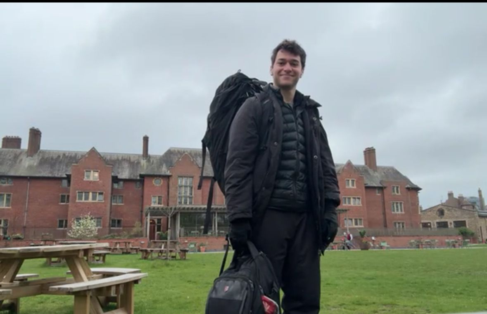
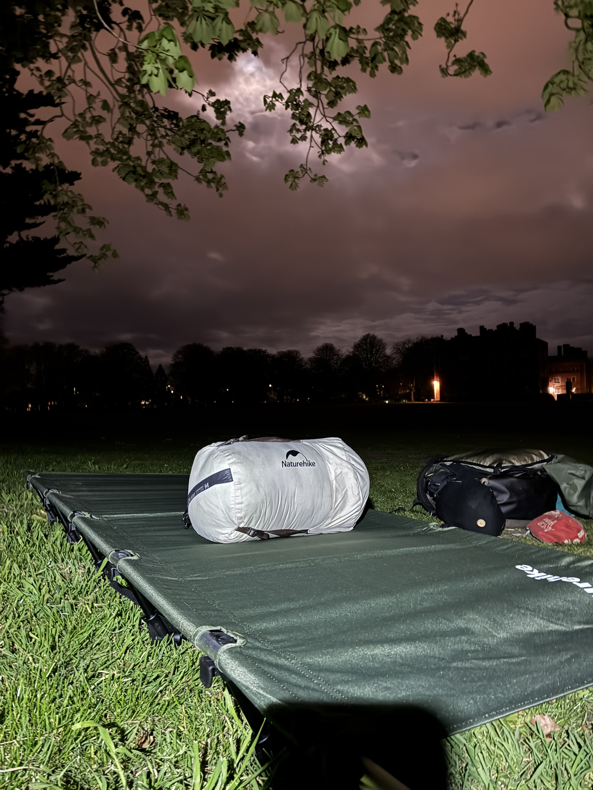
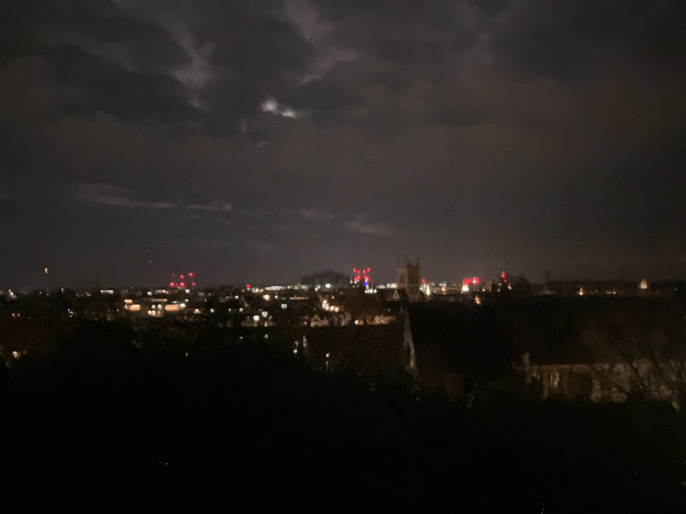
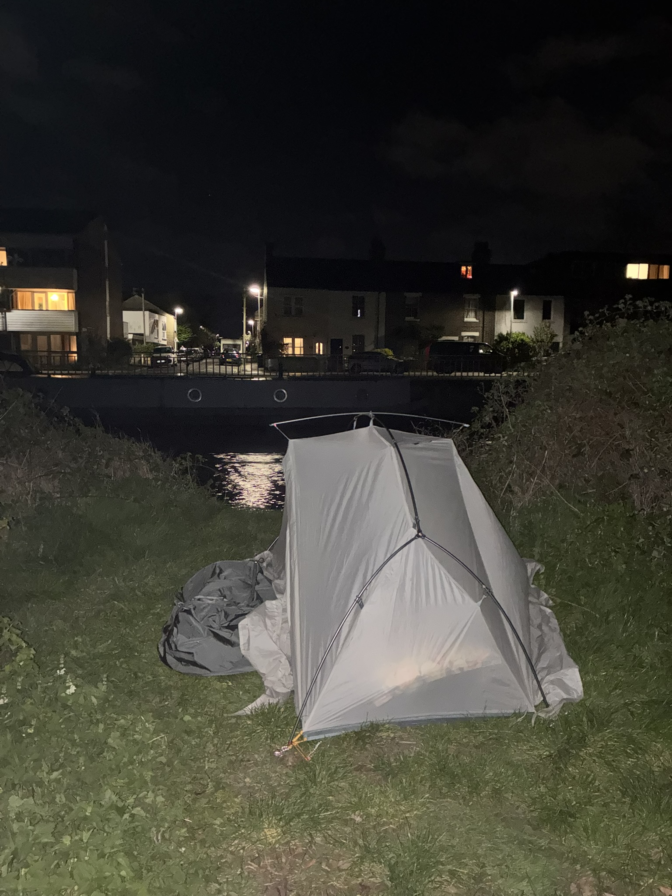
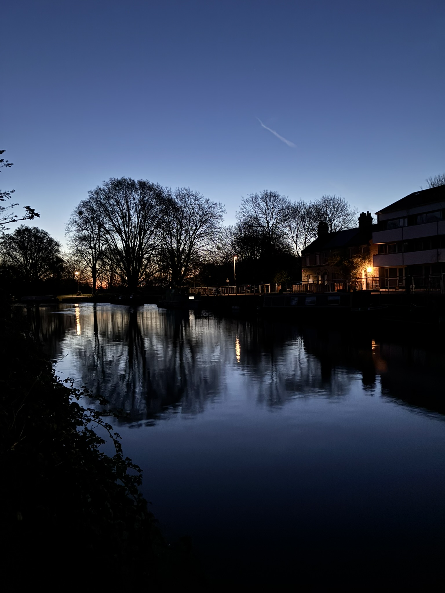
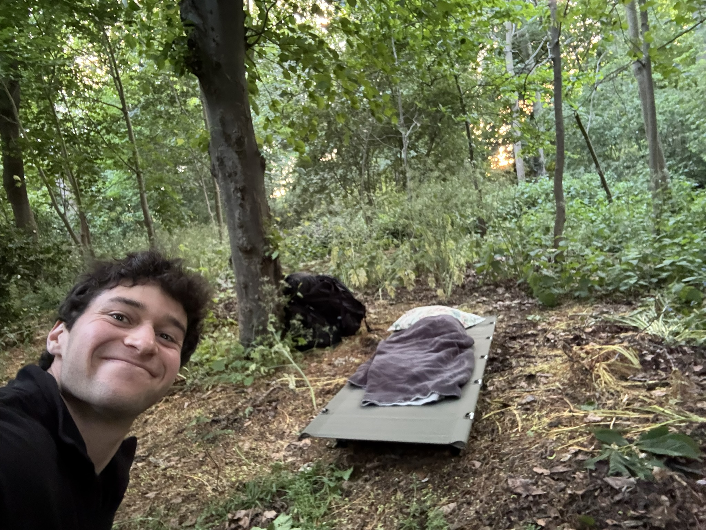
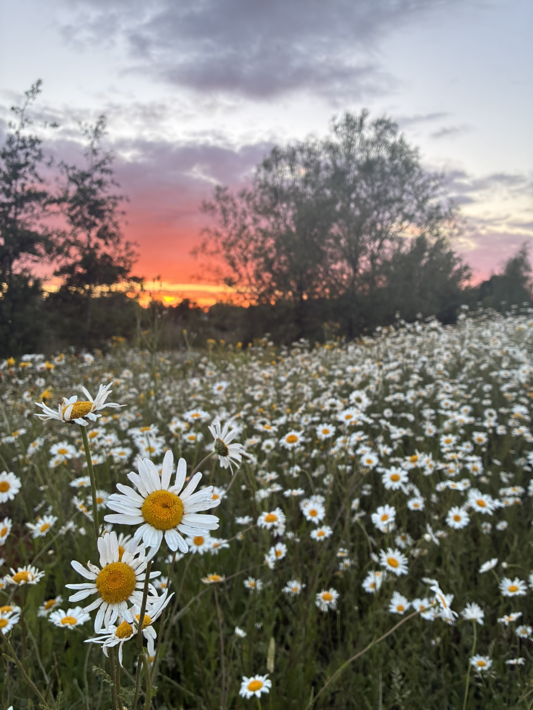
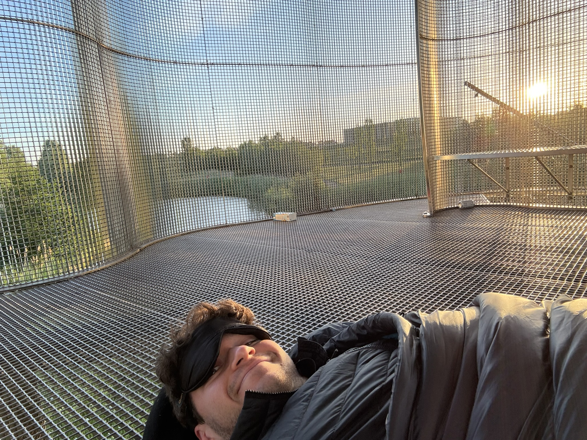
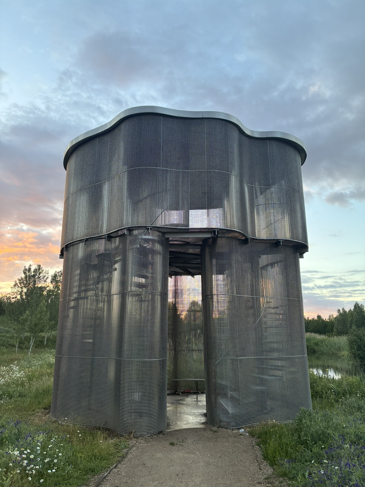
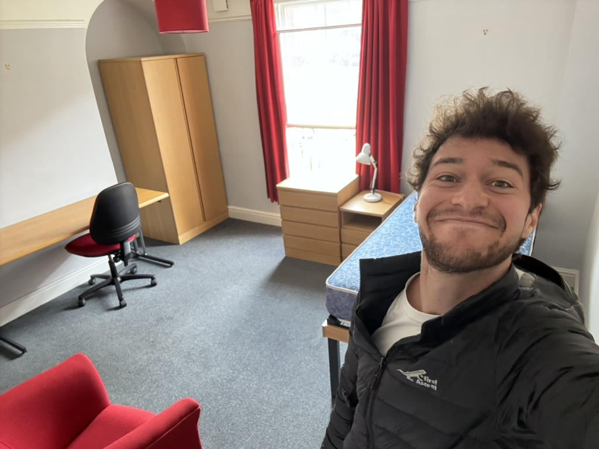

I've recently returned to conventional 'housed' living, after a six week experiment as a voluntarily unhoused PhD student in Cambridge.

I slept under the stars alongside tranquil dams, and in a wind-shook tent beside the river; on a hilltop overlooking the city lights, and on a cricket pitch beneath the full moon; took shelter in empty gym studios and unused office rooms; woke up in the dark woods to howling deer and scurrying foxes, and to the sound of the birds and a 4am sunrise atop a multi-story public sculpture; all whilst continuing with my usual PhD life.

In the following sections, I reflect deeper on some of the reasons I undertook this experiment, and some of the things I learned, grouped into nine themes:

1. [Money](#money)
2. [Freedom](#freedom)
3. [Nature](#nature)
4. [Minimalism](#minimalism)
5. [Resilience](#resilience)
6. [Timing](#timing)
7. [Romance](#romance)
8. [Humour](#humour)
9. [Privilege](#privilege)

Before we get going, here are some photos that convey an entirely overromanticized view of the experience (the reality was more like a bad night's sleep and hiding away in a corner of the office). There is also a FAQ section at the end with some common practical questions about my setup.

  
  
  
  
  
  
  
  
  

With that context, let's start with the first reason: saving money.
<h2 id="money">Money</h2>

>"Money is not going to solve all of your problems, but it's going to solve your money problems." – The Almanack of Naval Ravikant

The initial trigger for this experiment was simply the desire to avoid paying my UK rent unnecessarily when I was going to be away for a month in South Africa for a close friend's wedding. But then I thought – why stop there? Why am I paying so much of my scholarship stipend each month in rent to an institution to which I'm already paying exorbitant fees?

I'm not a financially driven person. I don't live extravagantly and don't need much to be happy. However, I aspire to the Buddhist ideal of love for all beings and try to orientate my life that way – and I know money can be helpful in this. It allows one to be generous in the micro – offer to pay the bill, buy small thoughtful gifts that show you care like flowers for friends, buy train tickets to visit close friends when they need you, support family members, etc – and in the macro money can go a long way to addressing poverty and addressing some of the world's biggest problems. My goal for the whole world would be for everyone to have enough so as for money to not get in the way of the things that matter.

I also know that savings can be immensely liberating. I remember when I returned to Cape Town in 2022 after completing my masters without a job or any savings, and the feeling of dependence and burden of having to ask my parents for a loan to pay my deposit and first month's rent before my first paycheck landed, and the discomfort at my privilege of being able to do so. I didn't want to be in that position again in my life, nor would I want anyone to have to be. Having a buffer of a few months' rent, without external dependence or debt, is immensely mentally liberating, and allows one to live more freely. I am thus always cognisant of ways to build a buffer of savings, and this is why the idea of saving a few months rent appealed to me financially.

In Cambridge I was staying in a 6-bedroom college-owned house, paying £670 a month for a small room with communal facilities. And £670 a month is considered an absolute bargain for a central spot in Cambridge – many students are paying upwards of £1,000 a month, or else living far from the centre. For some comparisons,  £670 a month equates to roughly £23 a day (and for South African readers this is around R15,000 a month, R500 a day). These numbers deeply sadden me. Common advice from South African expats in the UK is "don't convert between pounds and rands, you can't think that way". I disagree. Money saved in the UK can go so much further in South Africa and do so much good, and the exorbitant amount of money going towards already hugely wealthy university institutions sits strangely with me.

I also think about how in South Africa I had a beautiful 1-bedroom sea-view apartment in Sea Point, where I could walk down 100m for a swim in the ocean on a whim, and have a 10 minute bike ride into the office, for R11,000 a month. I felt and still feel uncomfortable about the privilege of that setup, surrounded by homeless people sleeping on the promenade less than a kilometre away. But yet then here I am paying 30% more than that, for a tiny room, towards an already hugely wealthy college, where there are so many unused buildings and rooms around. More of this sociopolitical commentary later.

So in essence my homelessness experiment enabled saving ~R15,000 a month on rent, for three months total (six weeks in Cambridge, and a prior six weeks between Scotland and South Africa for my friend's bachelors and wedding) – sizable savings that can hopefully be put to good use for the world. This idea of freedom from not having to pay rent is also why I love the idea of living in a (electric) campervan one day. It feels like it could be a scalable solution to housing concerns about land redistribution that avoids the complexities of property and land ownership – allowing the land to remain as a shared resource.
<h2 id="freedom">Freedom</h2>

> "There is no greater joy than to have an endlessly changing horizon, for each day to have a new and different sun." – Christopher McCandless, Into the Wild

I have been inspired by books of freedom and adventure like *Into The Wild*, *Siddhartha*, *Narcissus and Goldmund* and *The Alchemist*. I remember listening on repeat to The Fray's album *The Fray Is Back* whilst reading *Into The Wild* and associate that with my gap year to fly to New Zealand without a return ticket in 2024, after feeling a similar craving for freedom and adventure. I also think sometimes of the section of Forrest Gump when he runs the length of the USA, and when asked why he replies: 'I just felt like running!' I think part of it is a sense of freedom.

During my homeless stint in Cambridge, there was certainly a sense of freedom about choosing where to sleep each night. When I had tennis scheduled with a friend for 6am the following morning, I could choose to just set up my stretcher by the cricket pitch alongside it. Or I could choose to sleep at the office so I'm closer to work and a run with my friend the next morning. But I also became mindful about how this lent itself to an 'efficiency' mindset that can be unhealthy – what's wrong with just taking an extra 15 minutes to get there the next morning?
<h2 id="nature">Nature</h2>

> "Who looks upon a river in a meditative hour, and is not reminded of the flux of all things?" – Ralph Waldo Emerson, Nature

Part of the allure for me was removing barriers to spending more time in nature, something I know does my soul so much good, but I can feel reluctant to prioritize due to the convenience of staying in my room. Without a set place to return to, I hoped I would be forced to spend more time in public spaces like parks and nature reserves. As a result I experienced more sunrises and sunsets than I would have, noticed the sounds of the birds more, became aware of the phase of the moon, encountered foxes scurrying and the sound of the Muntjac Deer's howl. Whilst this was true, I was also humbled by the 4am summer sunrise light and loud sounds and insects biting in affecting my sleep when outdoors. Towards the end of the experiment, I was thus spending more and more nights sheltered in the relative comfort of the unused office rooms.
<h2 id="minimalism">Minimalism</h2>

> "Very little is needed to make a happy life; it is all within yourself, in your way of thinking." – Marcus Aurelius, Meditations

I have for many years been strongly influenced by philosophies of stoicism, buddhism and minimalism, which promote the virtues of simplicity, moderation and contentment. Part of my experiment was to put to empirically test for myself the degree to which a stable home affects one's well-being – with the important caveat (not afforded to most) of having the financial security of knowing I could always return to leased accommodation at my college whenever I decided to. I came up with a satisfying minimal camping setup – camping cot, sleeping bag, blowup pillow, bivvy bag, thermals, a sleep mask (for the 4am sun), ear plugs – all fitting into a single discreet pannier bag that fit on my bike rack. It's pretty cool that an entire mobile home can pack away into a single pannier bag atop a bike rack. Ultimately, it proved I could be okay with just this setup, but it did come at a cost – of sleep, of connection with others, of peace of mind. It has filled me with more gratitude upon having my own space with a comfortable bed again.
<h2 id="resilience">Resilience</h2>

>  "Is this the condition I so feared?" – Seneca, On Festivals and Fasting

Someone once pointed out to me that discomfort doesn't seem to faze me much. This certainly isn't always true, although I have come a long way in this regard, and part of it is due to training in embracing discomfort, through things like silent meditation retreats and multi-day fasts. Knowing my body can get through things like these makes the prospect of discomfort far less worrying.

Also, whilst I knew it would be uncomfortable, it was a good lesson that a lot of the lows  (loneliness, existentialism) were states I experienced even when housed – and which were actually just part of the natural seasons and impermanence of life's ups and downs, ebbs and flows (*anicca* in Pali).

However, this is not to say one should always keep oneself in a state of discomfort. It's enough to know deeply (if you're honest to oneself, not just as a story you tell yourself) that you genuinely would be fine in these scenarios. But then I don't believe constantly voluntarily being in hardship or discomfort would be reasonable or have any value. Doing the PhD whilst homeless was hard. I experienced loneliness and lack of connection, somewhat removed from people and society, by needing to decide where to sleep each night, and being secretive and guarded, and this held me back from my typical ideals of striving to a selfless and egoless nature.
<h2 id="timing">Timing</h2>

> "I can always go back to being a shepherd ... But maybe I'll never have another chance to get to the Pyramids in Egypt" – Paulo Coelho, The Alchemist

Another reason for doing this now, was that Cambridge made it so easy – so if ever there was a time, it was now. I had safe fallback spaces like the office and the college, so much university-wide well-being support, a very safe city. This experiment would not have felt possible in SA safety-wise. And moreover would have felt extremely distasteful given so many destitute people on the streets in real poverty. But more philosophically, it's also a reflection of the countless people I could count on to house me if I ever really needed, a luxury not afforded to most.

Trying this out in Cambridge also felt fitting, as a university-town notorious for students doing strange and unconventional things – like Lord Byron having a pet bear in his room (college rules forbade dogs, but said nothing about bears).
<h2 id="romance">Romance</h2>

> "When love beckons you, follow him. Though his ways are hard and steep." – Kahlil Gibran, The Prophet

It would be remiss of me not to mention one additional motivating factor that prompted me to do this experiment: my hopes of it enabling a romantic pursuit of mine. With the person in question living a long train ride away, I hoped to proactively counter the objection of the complexity of long-distance, since the extra savings and psychological freedom enabled by no ties to a lease would remove the financial and psychological barriers to making regular train journeys. I also lightheartedly thought it could come across as a romantic gesture – giving up worldly attachments in the name of romance. Whilst it did not pan out quite like that (another quote from The Prophet: "*do not try to direct the course of love, for love, if it finds you worthy, directs your course"*), I can have no regrets that I did not give it my all.
<h2 id="humour">Humour</h2>

> "I don't take myself too seriously! That makes me happy." — Dalai Lama XIV

I realize another reason for undertaking the experiment was as a way of reminding myself to not take myself too seriously, and approaching life with a lightheartedness and sense of play and curiosity. Although, this is with a big caveat of this coming from a place of serious privilege (more on that next).

I had some very humourous encounters during this period. Firstly, a story. When I arrived at Cambridge in October last year, I was meditating on my yoga mat in my college gardens, wrapped up in a blanket and beanie, when a porter walked fast towards me saying sternly: 'That's it, you need to get out of here, you can't be staying here'. Turns out I looked homeless, and my college had recently had issues with vagrants on the property. The porter was rather embarrassed when I pulled out my student card to prove I was in fact a student of the college. The porters still laugh with me about this. Little would they know that less than a year later I would actually prove that porter right! It felt rather comical that I actually did become a homeless student staying on the college grounds for a couple of nights.

Other funny stories include being sung a Twinkle Twinkle Little Star lullaby by a bemused couple who walked past me lying on my stretcher in the woods watching an episode of *Normal People* on my iPad; or when  two men came to smoke weed atop Castle Mound at 5am and encountered me sleeping there, and after I politely declined to join them and insisted I was sleeping there voluntarily (not out of need), which they did not believe – the one man proceeded to offer to introduce me to his boss and help me land a job as a punt tour guide – provided I take a shower and sharpen up a bit first!
<h2 id="privilege">Privilege</h2>

> "The rentier class ... the people who made money simply by owning something that others needed, and charging for the use of it: this is rent in its economic meaning. Rent goes to people who are not creators of value, but predators on the creation and exchange of value." – Kim Stanley Robinson, The Ministry for the Future

Finally, on a more serious note, this experiment enabled me to grapple with big societal questions of privilege and wealth inequality and justice, and class division and the ethics of land ownership via inheritance and institutions.

This experience has firstly highlighted again my own huge privilege: the education and upbringing and family love and support that got me here to Cambridge, where I have all these spaces like the office and the college available to me, and more generally in my life my privilege as part of a middle class, with so many family members and friends I could call on.

But I was also commenting on the injustices of colonialism and wealth, with Cambridge's wealth, as a metaphor for colonial wealth and injustice more generally. Cambridge institutions have exorbitant wealth and land, that students pay a fortune in fees for. Colleges like King's College own the Grantchester Meadows. Why should I feel bad about living quietly in these spaces? I was very careful to be quiet and discreet and not make anyone feel uncomfortable. And then there's the exorbitant money spent on May balls and fireworks and headline acts with one college attempting to outdo the other with extravagance. All with a backdrop of suffering and poverty hidden around the world, plus climate colonialism. I feel extra sensitive to this, seeing the inequality in South Africa, the injustice, and feel deep qualms with Europe's luxury and the complacency of the Western world to face this.
## Conclusions

Now back in my old room, I've come out with a fresh gratitude for my privileges and some things I'd taken for granted: the stability of a home, a community, and connection to society. But I also have a renewed quiet confidence in my ability to withstand discomfort, and in knowing I'd be okay if I were ever forced into homelessness by circumstance or desire for freedom, due to the support structures I can always fall back on. And I'm highly aware of how so many others don't have this luxury, and the injustices in society that perpetuate this being the case. I hope for a world where all people could have the freedom to undergo experiments like this – but where we all have enough security so as never to need to.

<figure class="collab-figure" style="max-width: 400px; margin: 20px auto;">
  
  <figcaption style="text-align: center; font-style: italic; margin-top: 8px;">A happy and grateful return to a room of my own six weeks later</figcaption>
</figure>

## FAQs

Q: What was your sleeping setup?
A: I iterated on this. The base was a stretcher camping cot. When I did my first experiment in early April, it was still pretty cold – I had a full sleeping bag, thick blanket, plus down thermals, fleece and puffer jacket, and still was cold. In summertime just a sleeping bag or even just a liner was enough.

Q: How well did you sleep?
A: This varied. In winter it was easier, I felt snug. Summer wasn't great. It was hot, the birds start chirping at 4am, and my body was sensitive to the light. I got a sleeping mask and ear-plugs. This lack of quality sleep was one of the main factors that prompted me to return to normal housed living.

Q: Where did you eat?
A: Fridges and microwave in both the college and the office. Microwaving veggies is energy-efficient and easy. Has been lovely being able to cook again now though... If I didn't have these, I have a Jetboil that is fantastic. My Jetboil plus Stanley thermoflask goes a long way: e.g. quinoa and lentils.

Q: Where did you shower?
A: In college gym or in the lab. If I didn't have these, one could take out a gym membership.

Q: Where did you wash your clothes?
A: The college has a communal laundry room with multiple machines and dryers. There were sadly no public laundry rooms in Cambridge to my knowledge. I'd be in favour of cheaper state-supported communal laundry rooms where you pay for the electricity usage and a small maintenance surcharge.

Q: Did you still have a social life?
A: Yes, although it was a bit more of a barrier. But over this time I still joined a new football group, tried salsa dancing, went on dates, met up with friends etc. But I do think I have much more energy now for social outings after being housed again.

Q: What did you do when it rained?
A: I checked the weather most nights, and would plan to be indoors those nights. On one occasion a thunderstorm did brew out of nowhere. Good thing my camping setup takes <5 minutes to disassemble, and I scurried to the safety of the common room.
